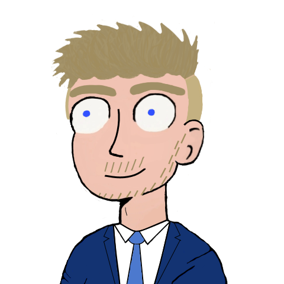

[![Contributors][contributors-shield]][contributors-url]
[![Forks][forks-shield]][forks-url]
[![Stargazers][stars-shield]][stars-url]
[![Issues][issues-shield]][issues-url]
[![MIT License][license-shield]][license-url]
[![LinkedIn][linkedin-shield]][linkedin-url]

<!-- PROJECT LOGO -->
 

  

  <h1 align="center">Neural Network Simulator</h1>

  

    
     
     
    <a href="https://github.com/DevonRD/NeuralNetwork">Project Link</a>
    ·
    <a href="https://github.com/DevonRD/NeuralNetwork/issues">Report Bug</a>
    ·
    <a href="https://devondoyle.com/">My Portfolio</a>
  

<!-- TABLE OF CONTENTS -->

  
<h2 style="display: inline-block">Table of Contents</h2>

  <ol>
    <li>
      <a href="#about-the-project">About The Project</a>
      <ul>
        <li><a href="#built-with">Built With</a></li>
      </ul>
    </li>
    <li>
      <a href="#getting-started">Getting Started</a>
      <ul>
        <li><a href="#prerequisites">Prerequisites</a></li>
      </ul>
    </li>
    <li><a href="#usage">Usage</a></li>
    <li><a href="#license">License</a></li>
    <li><a href="#contact">Contact</a></li>
  </ol>

<!-- ABOUT THE PROJECT -->
## About The Project

[![Product Name Screen Shot][product-header-image]](https://github.com/DevonRD/NeuralNetwork)

As an ongoing independent project from late high school, I decided to program an artificially-evolving 
neural network simulator using basic creatures in a predefined environment. I took inspiration from 
several other community programmers who made similar programs. This was my first attempt at using a 
neural network to facilitate fitness-based evolution.

### Built With

* [Java](https://www.java.com/en/)
* [Processing 3](https://processing.org/)

<!-- GETTING STARTED -->
## Getting Started

If you are interested, feel free to download and run this simulation for yourself. 
You can find it on this GitHub project repository. Download and run the "NeuralNetLatest.jar" file. 
I'm sure you will enjoy watching and interacting with the creatures of the simulation!

### Prerequisites

Make sure you have [Java](https://www.java.com/en/download/) installed on your system to run the .jar file.

<!-- USAGE EXAMPLES -->
## Usage

Once you run the file, the simulation will start immediately. Feel free to interact with the menu
to customize your simulation! Click on a creature or tile to see more information about it.

<!-- LICENSE -->
## License

Distributed under the MIT License. See `LICENSE` for more information.

<!-- CONTACT -->
## Contact

Devon Doyle [Portfolio](https://devondoyle.com/) - devonrd@umich.edu

Project Link: [https://github.com/DevonRD/NeuralNetwork](https://github.com/DevonRD/NeuralNetwork)

<!-- MARKDOWN LINKS & IMAGES -->
<!-- https://www.markdownguide.org/basic-syntax/#reference-style-links -->
[contributors-shield]: https://img.shields.io/github/contributors/DevonRD/repo.svg?style=for-the-badge
[contributors-url]: https://github.com/DevonRD/NeuralNetwork/graphs/contributors
[forks-shield]: https://img.shields.io/github/forks/DevonRD/repo.svg?style=for-the-badge
[forks-url]: https://github.com/DevonRD/NeuralNetwork/network/members
[stars-shield]: https://img.shields.io/github/stars/DevonRD/repo.svg?style=for-the-badge
[stars-url]: https://github.com/DevonRD/NeuralNetwork/stargazers
[issues-shield]: https://img.shields.io/github/issues/DevonRD/repo.svg?style=for-the-badge
[issues-url]: https://github.com/DevonRD/NeuralNetwork/issues
[license-shield]: https://img.shields.io/github/license/DevonRD/repo.svg?style=for-the-badge
[license-url]: https://github.com/DevonRD/NeuralNetwork/blob/master/LICENSE.txt
[linkedin-shield]: https://img.shields.io/badge/-LinkedIn-black.svg?style=for-the-badge&logo=linkedin&colorB=555
[linkedin-url]: https://linkedin.com/in/devon-doyle/
[product-header-image]: images/map.png
